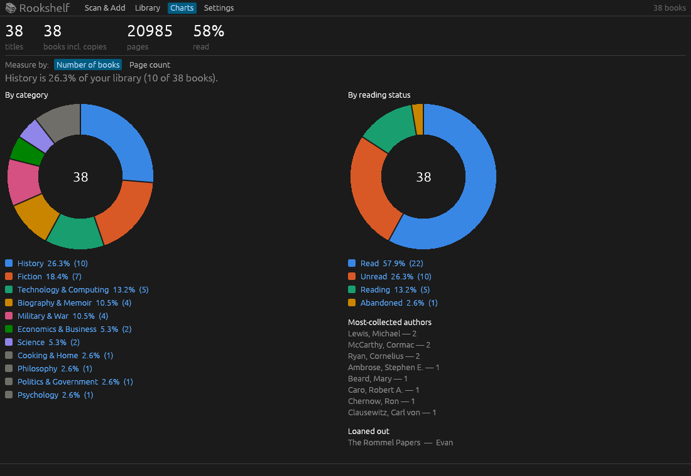
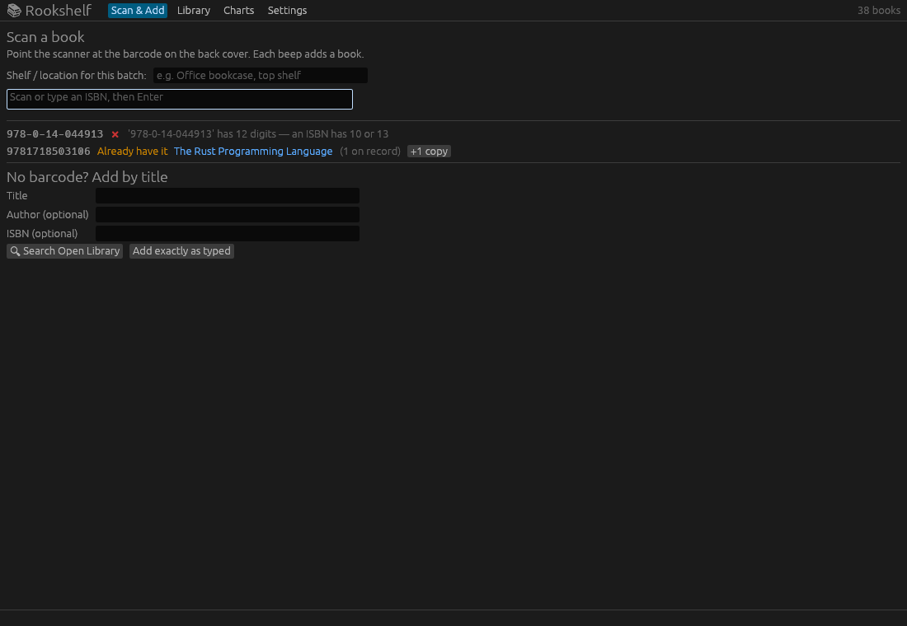
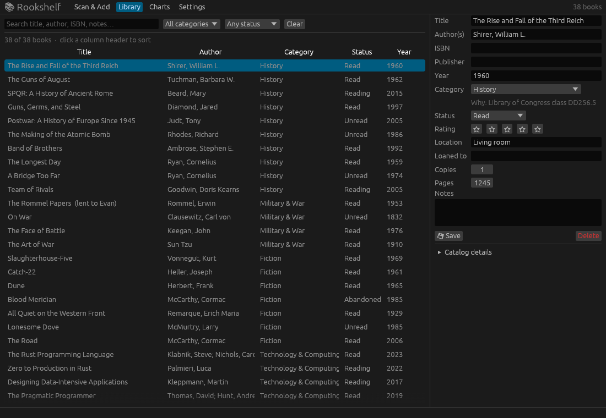

# Rookshelf

**A home library app for Windows, written in Rust.** Scan the barcode on a book, and Rookshelf looks it up, files it under a subject, and adds it to charts that show what your shelves are made of.



> "History is 26.3% of your library (10 of 38 books)."

## Features

- **Barcode scanning.** Works with any USB or Bluetooth barcode scanner. Scan book after book; each one is looked up and added automatically.
- **Automatic lookup.** Title, author, publisher, year, page count, subjects, and Library of Congress / Dewey class numbers come from [Open Library](https://openlibrary.org), with [Google Books](https://developers.google.com/books) as a backup. Both are free and need no API key.
- **Auto-categorizing.** Every book is sorted into one of 22 subject areas (History, Military & War, Fiction, Technology & Computing, and so on), and the app shows *why* it picked that one.
- **Pie charts.** Breakdowns by category and by reading status, counted by number of books or by page count. Click a category to see those books.
- **Add books by hand.** Search by title and author for books with no barcode, or type one in exactly as-is for old or self-published books.
- **Edit anything.** Change any field or move a book to another category. Categories you set by hand are never overwritten.
- **Track your reading.** Status (Unread, Reading, Read, Abandoned, Wishlist), 1–5 star ratings, shelf location, number of copies, notes, and who you've loaned a book to.
- **Duplicate check.** Scanning a book you already own tells you so, with a one-click "+1 copy" button.
- **CSV export** that opens in Excel.
- **No setup.** One `.exe` and one database file. Nothing to install and no server to run.

| Scanning | Library and editor |
|---|---|
|  |  |

## Getting started

### Option 1: download the app

1. Download `Rookshelf-windows.zip` from [Releases](https://github.com/saedarm/Rookshelf-App/releases).
2. Unzip it anywhere, for example `Documents\Rookshelf`.
3. Run `Rookshelf.exe`.

Your library is saved to `library.db` in the same folder. To back it up, copy that file.

> Windows may show a SmartScreen warning the first time, because the app isn't code-signed. Click **More info → Run anyway**.

### Option 2: build from source

You need [Rust](https://rustup.rs) (stable).

```
git clone https://github.com/saedarm/Rookshelf-App.git
cd Rookshelf-App
cargo run --release
```

The built app ends up at `target/release/rookshelf.exe`. It also runs on Linux and should build on macOS (untested).

## Setting up a barcode scanner

Most scanners work out of the box, because they act like a keyboard: they type the barcode digits and press Enter.

1. Pair the scanner with your PC in **HID / keyboard mode** (usually the default).
2. Test it in Notepad. A scan should type 13 digits and start a new line.
3. If it doesn't start a new line, turn on the **Enter (CR) suffix** setting. Most scanners do this by scanning a setup barcode from the manual.
4. In Rookshelf, stay on the **Scan & Add** tab while you scan. The scan box keeps focus, so you never have to click it.

Tip: fill in **Shelf / location** before a batch ("Office bookcase, top shelf"), and every book scanned in that batch gets that location.

Rookshelf handles ISBN-13 barcodes, ISBN-10 numbers (with or without dashes), and barcodes with the extra 5-digit price code. Misreads are caught by the ISBN checksum before any lookup happens.

## How categorizing works

Rookshelf checks these in order and uses the first one that matches:

1. **Fiction or biography in the subject headings.** Librarians file a WWII novel and a Patton biography under history, but on your shelf they're different kinds of book.
2. **Library of Congress class number.** For example, `D810` → History, `QA76` → Technology & Computing, `U` → Military & War. A librarian assigned it, so it's the most reliable signal.
3. **Dewey decimal number.** For example, `940.54` → History.
4. **Keywords** in the subject headings and title, matched as whole words.

Books that match nothing go to **Uncategorized**, and you can set them by hand.

To change the rules, edit `src/categorize.rs`, rebuild, and click **Settings → Re-categorize every book**. Books you categorized by hand are left alone.

## Settings

- **Contact email** (optional). Sent to Open Library with each lookup. Apps that identify themselves are allowed 3 lookups per second instead of 1. This only matters if you scan very fast.
- **Re-categorize every book.** Re-runs the categorizer after you change the rules.
- **Export to CSV.** Writes `library-export.csv` next to the app.

## Project layout

```
src/
  main.rs        window setup; library.db is stored next to the .exe
  app.rs         the UI: Scan & Add, Library + editor, Charts, Settings
  isbn.rs        clean up, validate, and convert scanned codes
  lookup.rs      Open Library and Google Books lookups
  categorize.rs  the subject-area rules
  db.rs          SQLite storage and CSV export
  pie.rs         donut chart drawing
```

Built with [egui/eframe](https://github.com/emilk/egui) for the interface, [rusqlite](https://github.com/rusqlite/rusqlite) (bundled SQLite) for storage, and [ureq](https://github.com/algesten/ureq) for web requests.

Run the tests with:

```
cargo test
```

## Roadmap

- [ ] Cover images in the book editor
- [ ] Import from a Goodreads CSV export
- [ ] "Where is it?" view grouped by shelf
- [ ] Printable spine labels with call numbers

## Credits

Book data comes from [Open Library](https://openlibrary.org) (Internet Archive) and [Google Books](https://books.google.com).
